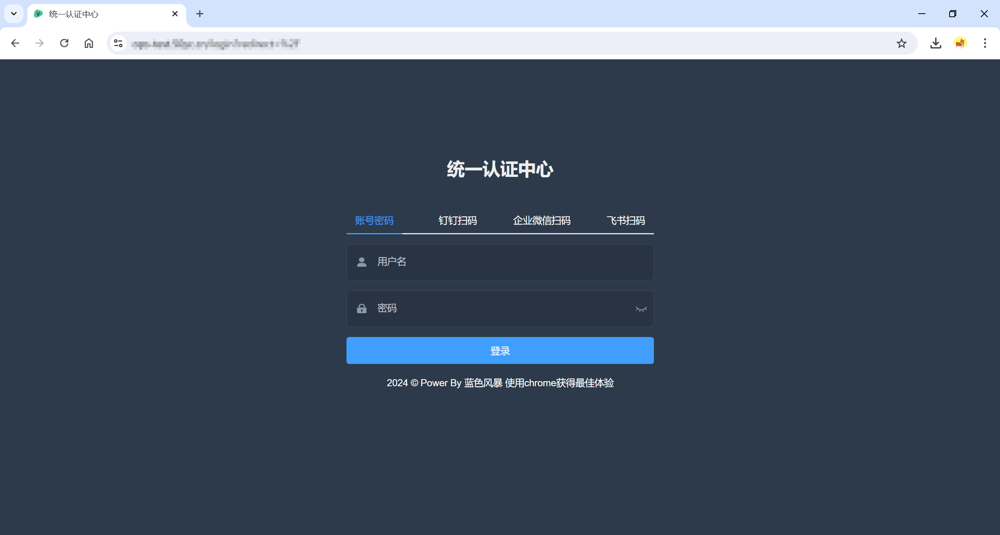
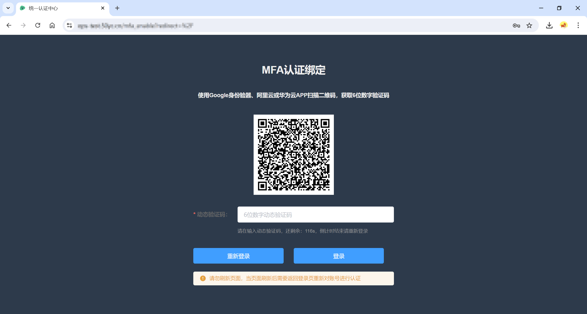

# IDSphere统一认证平台项目介绍
仅需一次认证，即可访问所有授权访问的应用系统，为企业办公人员提供高效、便捷的访问体验。
## 架构设计
项目采用前后端分离架构设计，项目地址如下：

| 项目  | 项目地址                                   |
|:----|:---------------------------------------|
| 前端  | https://github.com/yuyan075500/ops-web |                                                                                                              |
| 后端  | https://github.com/yuyan075500/ops-api |

如果你无法访问`GitHub`，可访问`Gitee`获取项目源代码，地址如下：

| 项目  | 项目地址                                  |
|:----|:--------------------------------------|
| 前端  | https://gitee.com/yybluestorm/ops-web |                                                                                                              |
| 后端  | https://gitee.com/yybluestorm/ops-api |
## 后端项目目录说明
* config：全局配置。
* controller：路由规则配置和接口的入参与响应。
* service：接口的处理逻辑。
* dao：数据库操作。
* model：数据库模型定义。
* db：数据库、缓存等客户端初始化。
* middleware：中间件层，作用于全局，如跨域、JWT认证、权限校验等。
* utils：工具层，如Token解析，文件操作等。
## 后端项目返回Code状态码说明
* 0：请求成功。
* 90400：请求参数错误。
* 90401：认证失败。
* 90403：拒绝访问。
* 90404：访问的对象或资源不存在。
* 90500：其它错误。
* 90514：Token过期或无效。
# 项目功能概览
## 认证相关
* **SSO单点登录**：支持`CAS 3.0`、`OAuth 2.0`、`OIDC`和`SAML2`协议，使用方法可以参考 [客户端配置指南](https://github.com/yuyan075500/ops-api/blob/main/deploy/sso.md "配置指南") 和 [已测试客户端列表](https://github.com/yuyan075500/ops-api/blob/main/deploy/sso.md#%E5%B7%B2%E6%B5%8B%E8%AF%95%E9%80%9A%E8%BF%87%E7%9A%84%E5%AE%A2%E6%88%B7%E7%AB%AF "客户端列表")。
* **用户认证**：同时支持 [钉钉扫码登录](https://github.com/yuyan075500/ops-api/blob/main/deploy/dingtalk.md "扫码配置")、[企业微信扫码登录](https://github.com/yuyan075500/ops-api/blob/main/deploy/wechat.md "企业微信配置")、[飞书扫码登录](https://github.com/yuyan075500/ops-api/blob/main/deploy/feishu.md "飞书扫码配置")、[OpenLDAP认证、Windows AD认证](https://github.com/yuyan075500/ops-api/blob/main/deploy/deploy.md#ldap%E9%85%8D%E7%BD%AE "LDAP配置") 和本地账号认证。前端登录页面支持个性化配置，显示某个平台扫码登录选项，具体可以参考 [前端配置指南](https://github.com/yuyan075500/ops-web "前端配置")。
* **双因素认证**：支持使用Google Authenticator（Google身份验证器）、阿里云APP和华为云APP进行双因素认证。

    <br>
    
    
    <br>

### 用户登录策略
✅支持，🟡敬请期待，❌不支持

| 用户来源       | 用户登录 | 账号同步 | 用户密码修改 | 用户信息修改（电话、邮箱、密码过期时间） | 双因素认证 | 单点登录 | [NGINX鉴权](https://github.com/yuyan075500/ops-api/blob/main/deploy/sso.md#nginx%E4%BB%A3%E7%90%86%E9%89%B4%E6%9D%83 "NGINX鉴权") |
|:-----------|:-----|:-----|:-------|:---------------------|:------|:-----|:------------------------------------------------------------------------------------------------------------------------------|
| 本地         | ✅    | ✅    | ✅      | ✅                    | ✅     | ✅    | ✅                                                                                                                             |
| Windows AD | ✅    | ✅    | ✅      | 🟡                   | ✅     | ✅    | ✅                                                                                                                             |
| OpenLDAP   | ✅    | ✅    | ✅      | 🟡                   | ✅     | ✅    | ✅                                                                                                                             |
| 钉钉         | ✅    | ❌    | ❌      | ❌                    | ❌     | ✅    | 🟡                                                                                                                            | 
| 企业微信       | ✅    | ❌    | ❌      | ❌                    | ❌     | ✅    | 🟡                                                                                                                            | 
| 飞书         | ✅    | ❌    | ❌      | ❌                    | ❌     | ✅    | 🟡                                                                                                                            | 
### 账号同步规则
无论使用哪一种用户认证方式，都需要确保本地系统中用户存在，所以当配置好Windows AD或OpenLDAP后，需要登录平台点击【用户管理】-【分组管理】-【LDAP账号同步】执行一次用户同步，用户的同步规则如下：
1. 如果本地系统中没有，LDAP中有，则创建。
2. 如果本地系统有，LDAP中有，则更新（仅更新用户来源为LDAP且`username`相同，更新手机号、邮箱和密码过期时间字段）。

同步用户时，本地数据库和目标用户字段映射规则如下：
```shell
# OpenLDAP
{
	"name": "cn",
	"username": "uid",
	"email": "mail",
	"phone_number": "mobile"
	"password_expired_at": "shadowMax"
	"is_active": "shadowExpire"
}

# Windows AD
{
	"name": "cn",
	"username": "sAMAccountName",
	"email": "mail",
	"phone_number": "mobile",
	"is_active": "userAccountControl"
}
```
以下是创建一个OpenLDAP用户的必要属性如下：

| 属性名称             | 示例值                          | 描述                                       |
|------------------|:-----------------------------|:-----------------------------------------|
| objectClass      | inetOrgPerson                | 固定值，主要用于配置账号用户相关信息                       |
| objectClass      | shadowAccount                | 固定值，主要用于配置账号密码相关信息                       |
| uid              | lisi                         | 用户名                                      |
| givenName        | 李                            | 姓                                        |
| sn               | 四                            | 名                                        |
| displayName      | 李四                           | 显示姓名                                     |
| shadowMin        | 0                            | 从上次修改密码后，多久可再次修改密码，0表示不限制                |
| shadowWarning    | 0                            | 密码过期前多久开始提示，0表示不提示                       |
| shadowInactive   | 0                            | 密码过期后还可以登录的天数，0表示过期后不允许登录                |
| cn               | 李四                           | 通常与`givenName`和`sn`组合而成                  |
| shadowExpire     | 99999                        | 账号过期时间，该值表示距离1970-01-01的天数，其中99999表示永不过期 |
| shadowMax        | 90                           | 密码过期最大天数                                 |
| mail             | lisi@qq.com                  | 邮箱地址                                     |
| mobile           | 153****1111                  | 手机号                                      |
| userPassword     | {SHA512}5r0h********piEgNEu6 | 用户密码，使用`IDSphere`平台修改用户密码，默认采用`SHA512`加密 |
| shadowLastChange | 20068                        | 最后一次更改密码的时间，该值表示距离1970-01-01的天数          |

## 企业级账号管理
## 域名及证书管理
## 其它
* 支持`Swagger`接口文档：部署成功后访问地址为：`/swagger/index.html`，无需要登录。
* 支持用户密码自助更改：部署成功后访问地址：`/reset_password`，无需要登录。
* 支持企业网站导航：部署成功后访问地址：`/sites`，无需要登录。
* 支持企业账号密码管理，登录后位于左侧【资产管理】-【账号管理】。
# 项目部署
参考 [Docker Compose部署](https://github.com/yuyan075500/ops-api/blob/main/deploy/deploy.md#docker-compose%E9%83%A8%E7%BD%B2 "docker-compose部署") 和 [Kubernetes部署](https://github.com/yuyan075500/ops-api/blob/main/deploy/deploy.md#kubernetes%E9%83%A8%E7%BD%B2 "Kubernetes部署")。
# 开发环境搭建
参考 [开发环境搭建](https://github.com/yuyan075500/ops-api/blob/main/deploy/dev.md "开发环境搭建")。
# 项目交流
如果你对此项目感兴趣，可添加作者联系方式
WeChat：270142877。  
Email：270142877@qq.com。  
<br>
联系时请注名来意。