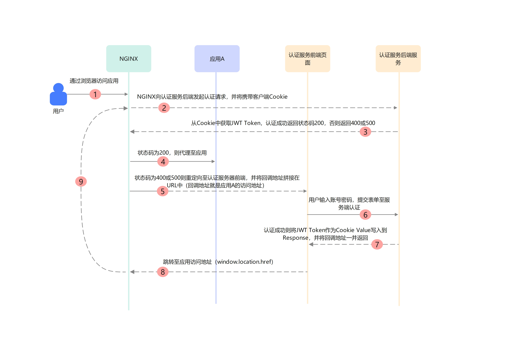

# IDSphere 统一认证平台 SSO 功能介绍
&nbsp;&nbsp;&nbsp;&nbsp;IDSphere 统一认证平台支持与使用 `CAS 3.0`、`OAuth 2.0`、`OIDC`和`SAML2` 协议的客户端进行对接。本指南提供了标准客户端的对接方法，另外也提供了 [已通过测试的客户端列表](#已测试通过的客户端) 以供参考。  
<br>
**注意：目前所有对接协议都不支持单点注销，不支持Token刷新。**
# CAS3.0 客户端配置
1. **用户登录**: `https://<平台域名>/login`。  
用户登录成功后会携带票据信息跳转至客户端指定回调地址。
2. **票据校验**: `https://<平台域名>/p3/serviceValidate`。  
票据校验通过后平台将以XML形式返回用户ID、邮箱、姓名、电话和用户名，对应字段为：`id`、`email`、`name`、`phone_number`和`username`。
# OAuth2.0 客户端配置
OAuth2.0登录协议仅支持授权码模式。
1. **用户登录**: `https://<平台域名>/login`。  
用户登录成功后会携带授权码和状态码跳转至客户端指定回调地址。
2. **获取Token**: `https://<平台域名>/api/v1/sso/oauth/token`。  
获取Token仅支持使用`POST`请求，需要携带授权码、客户端ID、客户端密钥、回调地址等参数，授权成功后将返回Token信息如下：
    ```json
    {
        "id_token": "",
        "access_token": "",
        "token_type": "bearer",
        "expires_in": 3600,
        "scope": "openid"
    }
    ```
    `id_token`和`access_token`都是为 JWT 格式的 Token。
3. **获取用户信息**: `https://<平台域名>/api/v1/sso/oauth/userinfo`。  
获取用户信息接口为`GET`请求，需要在请求头中按`token_type`的要求，在请求头中携带`Authorization`字段，值为`Bearer <access_token>`。该接口以JSON格式返回用户ID、邮箱、姓名、电话和用户名，对应字段为：`id`、`email`、`name`、`phone_number`和`username`。
# OIDC 客户端配置
OIDC的配置信息接口地址为：`https://<平台域名>/.well-known/openid-configuration`，关于接口具体请求和返回可以参考[OAuth2.0客户端配置](#OAuth2.0客户端配置)。
# SAML2 客户端配置
**IDP的元数据接口**地址为：`https://<平台域名>/api/v1/sso/saml/metadata`，元数据返回的组织和联系人信息可以直接修改接口对应的方法进行自定义。
# Nginx 代理鉴权
对于一些客户端可以在没有账号密码的情况下进行访问，如：Kibana、Consul Server UI等，为了实现这类客户端的认证，可以使用Nginx对这类客户端进行代理，跳转至本平台进行认证。
<br>
因为是基于Cookie实现，对于这类客户端也有一定使用，要求如下：
1. 客户端的所在域必须与SSO平台所在的二级域一致，假如平台的访问域名为：`test.ops.cn`，则客户端的所在域必须为`xxx.ops.cn`。
2. 不支持非域名访问的客户端。如：`127.0.0.1`、`localhost`、`192.168.1.10`等。 
3. 不支持非HTTPS应用。
## 认证流程

## 认证规则
假设有A、B、C三个客户端应用都使用Nginx进行代理鉴权，鉴权规则如下：
* 如果用户未登录平台，当访问A、B、C三个客户端应用中的任何一个都将跳转至登录界面。
* 如果用户已经登录平台，当访问A、B、C三个客户端应用中的任何一个都能直接访问应用。
## Nginx 配置
在开始配置前请确保Nginx支持auth_request模块，可以使用命令`nginx -V`查看，具体配置如下：
```nginx
server {
	listen 80;

	location / {
		auth_request /auth;
		error_page 401 500 = @error401;
		# 下面是被代理应用的相关配置
	}
	
	location = /auth {
		internal;
		proxy_pass_request_body off;
		proxy_set_header Content-Length "";
		proxy_set_header X-Original-URI $request_uri;
		proxy_set_header Cookie $http_cookie;
		proxy_pass https://<平台域名>/api/v1/sso/cookie/auth;
	}

	# 认证失败后的处理
	location @error401 {
		# 跳转至登录页
		return 302 https://<平台域名>/login?nginx_redirect_uri=$scheme://$host$request_uri;
	}
}
```
在上面的示例中对`/`根路径进行了鉴权，如果需要对其它路径进行鉴权可以添加其它location，并配置`auth_request`和`error_page`。
## Kubernetes Ingress 配置
```yaml
kind: Ingress
apiVersion: networking.k8s.io/v1
metadata:
  name: my-app
  annotations:
    nginx.ingress.kubernetes.io/auth-url: https://<平台域名>/api/v1/sso/cookie/auth
    nginx.ingress.kubernetes.io/server-snippet: |
      error_page 401 500 = @login;
      proxy_set_header Cookie $http_cookie;
      location @login {
        return 302 https://<平台域名>/login?nginx_redirect_uri=$scheme://$host$request_uri;
      }
spec:
  ingressClassName: nginx
  tls:
    - hosts:
        - my-app.test.cn
      secretName: test.cn
  rules:
    - host: my-app.test.cn
      http:
        paths:
          - path: /
            pathType: Prefix
            backend:
              service:
                name: my-app
                port:
                  number: 80
```
# 已测试通过的客户端
针对 `CAS3.0`、`OAuth2.0`、`SAML2`、`OIDC` 协议，目前经测试对接成功的SSO客户端如下：

| 客户端名称      | 对接协议名称   | 参考文档                                                                                               |
|:-----------|:---------|----------------------------------------------------------------------------------------------------|
| Grafana    | OAuth2.0 | [参考文档](https://github.com/yuyan075500/ops-api/blob/main/deploy/sso_example/grafana.md "参考文档")      |
| Jenkins    | CAS3.0   | [参考文档](https://github.com/yuyan075500/ops-api/blob/main/deploy/sso_example/jenkins.md "参考文档")      |
| Zabbix     | SAML2    | [参考文档](https://github.com/yuyan075500/ops-api/blob/main/deploy/sso_example/zabbix.md "参考文档")       |
| 华为云        | SAML2    | [参考文档](https://github.com/yuyan075500/ops-api/blob/main/deploy/sso_example/huawei_cloud.md "参考文档") |
| JumpServer | OAuth2.0 | [参考文档](https://github.com/yuyan075500/ops-api/blob/main/deploy/sso_example/jumpserver.md "参考文档")   |
| Jira       | OAuth2.0 | [参考文档](https://github.com/yuyan075500/ops-api/blob/main/deploy/sso_example/jira.md "参考文档")         |
| Confluence | OAuth2.0 | [参考文档](https://github.com/yuyan075500/ops-api/blob/main/deploy/sso_example/confluence.md "参考文档")   |
| KubePi     | OIDC     | [参考文档](https://github.com/yuyan075500/ops-api/blob/main/deploy/sso_example/kubepi.md "参考文档")       |
| 阿里云        | SAML2    | [参考文档](https://github.com/yuyan075500/ops-api/blob/main/deploy/sso_example/aliyun.md "参考文档")       |
| 腾讯云        | SAML2    | [参考文档](https://github.com/yuyan075500/ops-api/blob/main/deploy/sso_example/tencent.md "参考文档")      |
| Minio      | OIDC     | [参考文档](https://github.com/yuyan075500/ops-api/blob/main/deploy/sso_example/minio.md "参考文档")        |
| GitLab     |          | 待测试                                                                                                |
| 天翼云        |          | 待测试                                                                                                |
| Rancher    |          | 待测试                                                                                                |
| 禅道         |          | 待测试                                                                                                |
| AWS        |          | 待测试                                                                                                |

PS：如果你有其它第三方系统需要对接可以提交 `Issues` 请求。