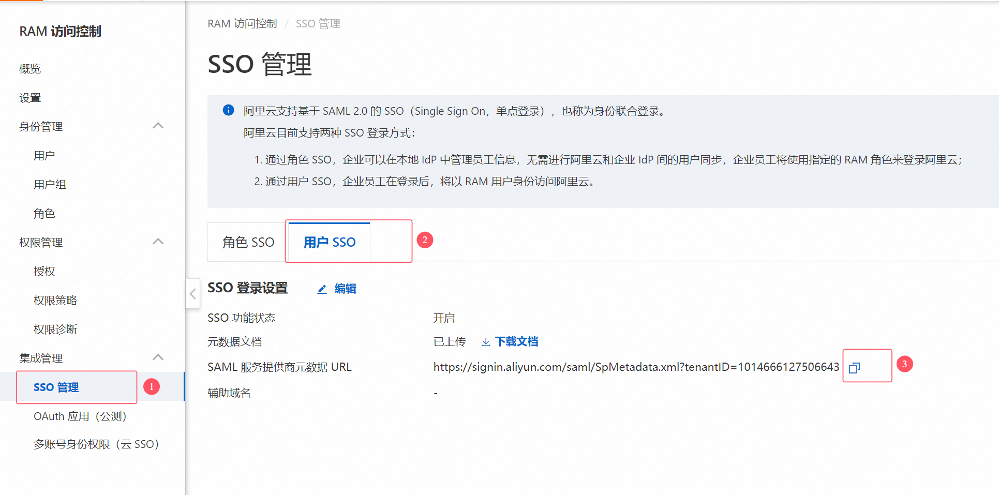
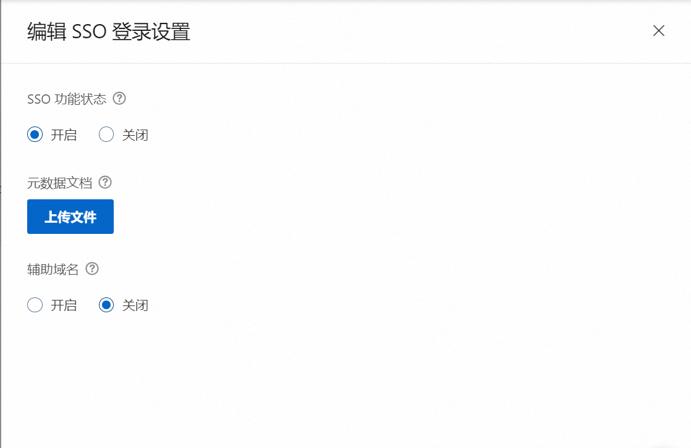
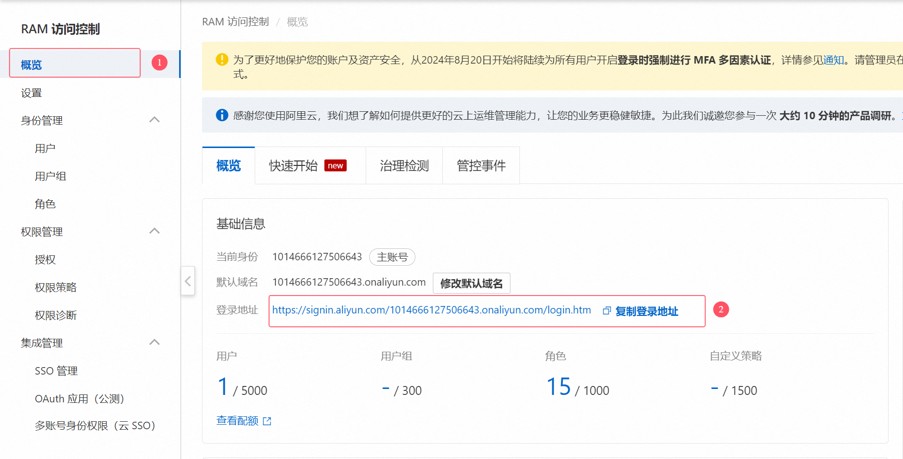
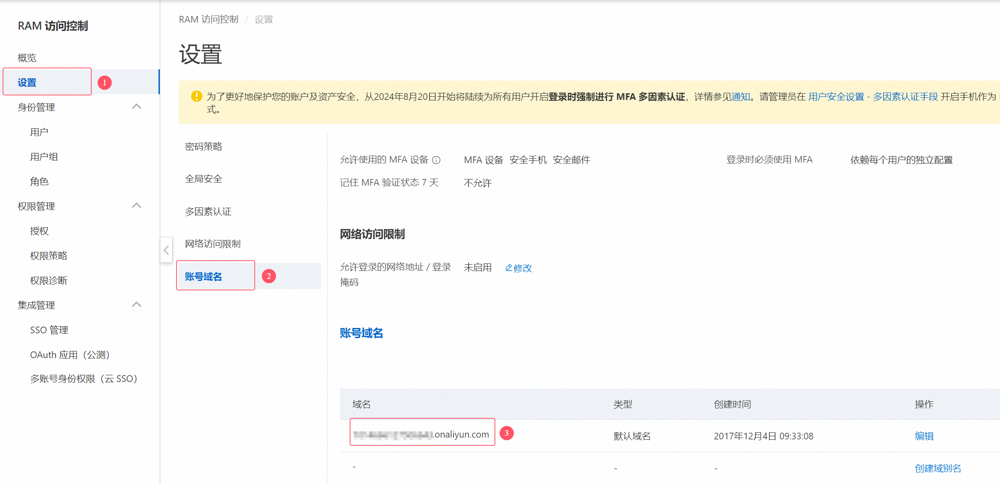
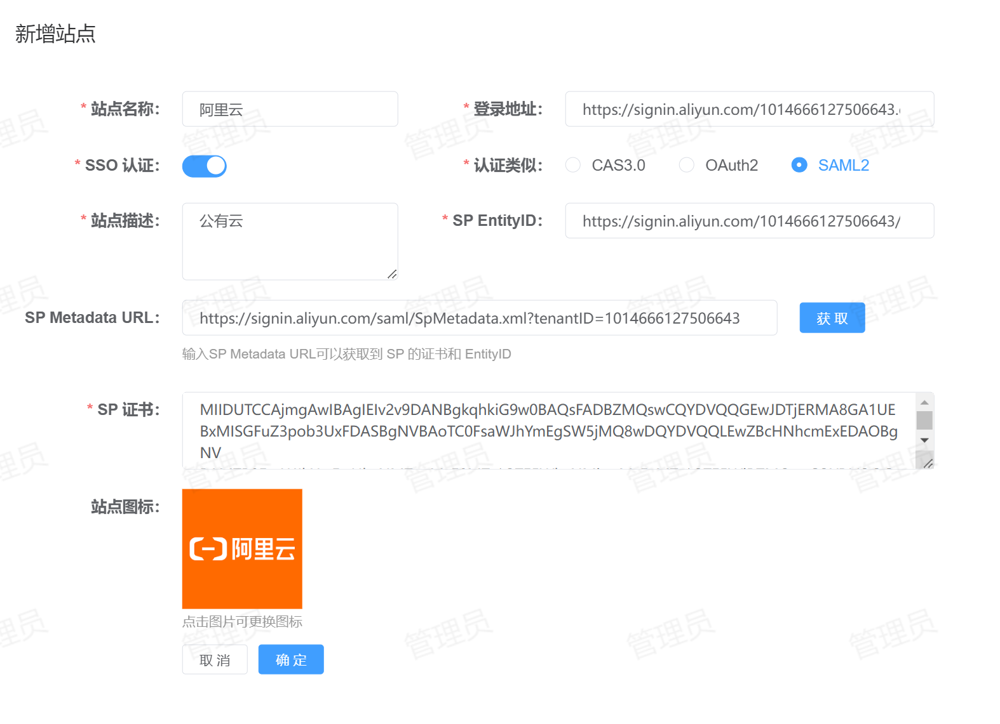
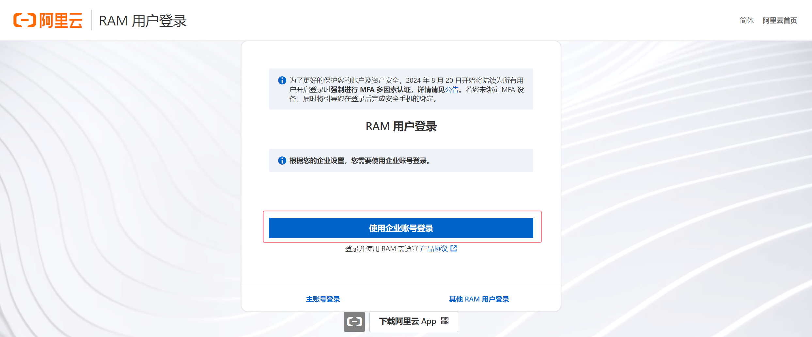

# 阿里云单点登录
阿里云支持的单点登录方式：SAML2。
## 配置方法
1. **获取阿里云元数据**：登录阿里云，进入【RAM访问控制】台，进入【用户SSO】管理。  
  
保存 SAML 服务提供商元数据 URL 地址，后续在 IDSphere 统一认证平台注册站点时需要使用。  
2. **创建身份提供商**：点击SSO登录设置右边的【编辑】按钮，如下图所示：  
  
   * SSO 功能状态：开启。
   * 元数据文件：这里需要上传 IDP元数据文件， IDP 的元数据文件可以访问 IDSphere 统一认证平台获取，地址为：`<externalUrl>/api/v1/sso/saml/metadata`。
   * 辅助域名：建议关闭。  
3. **获取登录地址**：点击【概览】，如下图所示：  
  
请保存登录地址，后续在 IDSphere 统一认证平台注册站点时需要使用。  
4. **获取账号域名**：点击【设置】-【账号域名】获取，如下所示：  
  
请保存域名，后续在 IDSphere 统一认证平台注册站点时需要使用。  
5. **站点注册**：登录到 IDSphere 统一认证平台，点击【资产管理】-【站点管理】-【新增】将阿里云站点信息注册到 IDSphere 统一认证平台，如下所示：  
  
   * 站点名称：指定一个名称，便于用户区分。
   * 登录地址：填写从`第3步`中获取的登录地址。
   * SSO 认证：启用。
   * 认证类型：选择 `SAML2`。
   * 站点描述：描述信息。
   * SP Metadata URL：填写从`第1步`中获取的地址，点击【获取】可以自动从阿里云元数据中加载 `SP EntityID` 和 `SP 证书` 相关信息。  
6. **创建RAM用户**：需要确保阿里云 RAM 用户名部分和 IDSphere 统一认证平台中用户的 `username` 保持一致，所有 IDSphere 统一认证平台中需要登录到阿里云的账号都需要创建一个与之对应的阿里云 RAM 实体用户。  
7. **站点修改**：登录到 IDSphere 统一认证平台的 `MySQL` 数据库中，在 `site` 表中找到刚注册的站点信息，将字段 `domain_id` 的值修改为从`第4步`中获取的域名。  
8. **登录测试**：在浏览器打开从`第3步`中获取的登录地址，然后点击【使用企业账号登录】即可，如下图所示：  
