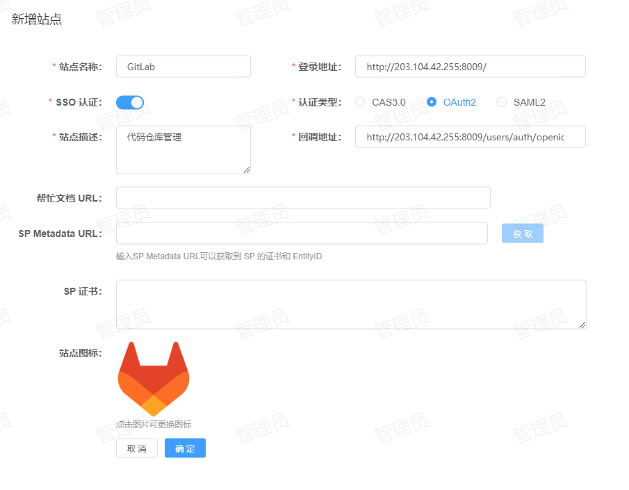

# GitLab 单点登录
GitLab 支持的单点登录方式：OIDC
## 配置方法
1. **站点注册**：登录到 IDSphere 统一认证平台，点击【资产管理】-【站点管理】-【新增】将 GitLab 站点信息注册到 IDSphere 统一认证平台，配置如下所示：<br><br>
   
    * 站点名称：指定一个名称，便于用户区分。
    * 登录地址：GitLab 的登录地址。
    * SSO 认证：启用。
    * 认证类型：选择 `OAuth2`。
    * 站点描述：描述信息。
    * 回调地址：GitLab 的回调地址，默认为：`http[s]://<address>[:<port>]/users/auth/openid_connect/callback`。<br><br>
2. **GitLab配置**：编辑 GitLab 的配置文件，通常是 `gitlab.rb` 文件中添加如下配置：
   ```shell
   gitlab_rails['omniauth_enabled'] = true
   gitlab_rails['omniauth_allow_single_sign_on'] = ['openid_connect']
   gitlab_rails['omniauth_sync_email_from_provider'] = 'openid_connect'
   gitlab_rails['omniauth_sync_profile_from_provider'] = ['openid_connect']
   gitlab_rails['omniauth_sync_profile_attributes'] = ['email']
   gitlab_rails['omniauth_auto_sign_in_with_provider'] = 'openid_connect'
   gitlab_rails['omniauth_block_auto_created_users'] = true
   gitlab_rails['omniauth_auto_link_user'] = ['openid_connect']
   gitlab_rails['omniauth_providers'] = [
     {
       name: "openid_connect",
       label: "IDSphere 统一认证中心",
       args: {
         name: "openid_connect",
         scope: ["openid"],
         response_type: "code",
         issuer: "<externalUrl>",
         discovery: true,
         client_auth_method: "query",
         uid_field: "sub",
         send_scope_to_token_endpoint: "false",
         client_options: {
           identifier: "<Client Id>",
           secret: "<Client Secret>",
           redirect_uri: "<你的GitLab访问地址>/users/auth/openid_connect/callback"
         }
       }
     }
   ]
   ```
    * omniauth_enabled：`true`，表示启用外部身份验证。
    * omniauth_allow_single_sign_on：固定值 `openid_connect`，表示通过 OpenID Connect 提供单点登录（SSO）。
    * omniauth_sync_email_from_provider：固定值 `openid_connect`，表示通过 OpenID Connect 同步用户邮箱。
    * omniauth_sync_profile_from_provider：固定值 `openid_connect`，表示通过 OpenID Connect 同步个人信息。
    * omniauth_sync_profile_attributes：更改为 `email`，指定每次授权都要从指定的外部身份提供商同步的用户属性。
    * omniauth_auto_sign_in_with_provider：固定值 `openid_connect`，启用自动登录，并指定使用 OpenID Connect。
    * omniauth_block_auto_created_users：`true`，启用自动创建用户，新用户将会锁定，需要管理员解锁后才可以使用。
    * omniauth_auto_link_user：`true`，表示自动关联一个 GitLab 中存在的用户。
    * omniauth_providers：关于 OpenID Connect 的详细配置。<br><br>
   关于 `omniauth_providers` 配置说明如下：
    * name：固定值 `openid_connect`。
    * label：显示在 GitLab 登录页面上的按钮名称。
    * args.name： 固定值 `openid_connect`。
    * args.scope：指定请求的权限范围，默认为 `openid`。
    * args.response_type：固定值 `code`。
    * args.issuer：指定 OIDC 服务器的地址，为后端服务配置文件中指定的 `externalUrl` 值。
    * args.discovery：自动发现 OIDC 服务器的元数据，默认为 `true`。
    * args.client_auth_method：固定值 `query`。
    * args.uid_field：固定值 `sub`。
    * args.send_scope_to_token_endpoint：固定值 `false`。
    * args.client_options.identifier：指定客户端的 ID，在 IDSphere 统一认证平台站点详情中获取。
    * args.client_options.secret：指定客户端的密钥，在 IDSphere 统一认证平台站点详情中获取。
    * args.client_options.redirect_uri：指定回调地址，默认为 `http[s]://<address>[:<port>]/users/auth/openid_connect/callback`。<br><br>

**注意**：如果你 GitLab 中的用户来源于 LDAP，那么在配置的时候，需要将 `omniauth_auto_link_ldap_user` 设置为 `true`，这样当使用 OIDC 登录时，GitLab 会自动关联 LDAP 中的用户。