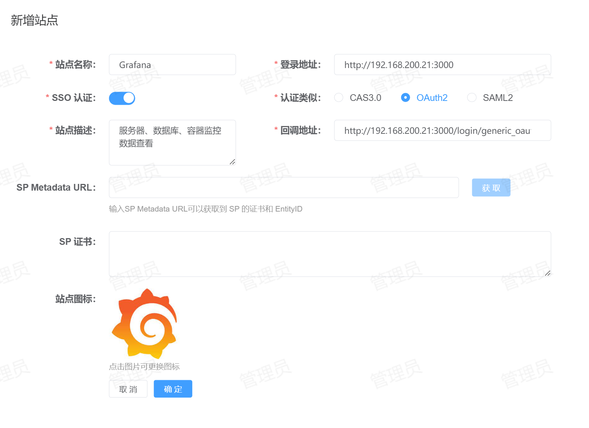

# Grafana 单点登录
支持的单点登录方式：OAuth2.0
## 配置方法
1. **站点注册**：登录到平台，点击【资产管理】-【站点管理】-【新增】将Grafana站点信息注册到平台，配置如下所示：

    * 站点名称：指定一个名称，便于用户区分。
    * 登录地址：Grafana的登录地址。
    * SSO认证：启用。
    * 认证类型：选择`OAuth2`。
    * 站点描述：描述信息。
    * 回调地址：单点登录的回调地址，务必填写正确，默认为：`<protocol>://<address>[:<port>]/login/generic_oauth`。
2. **Grafana配置修改**：编辑`grafana.ini`配置文件，修改的配置项如下所示：
    ```shell
    [server]
    # Grafana登录相关配置
    protocol = http
    http_port = 3000
    domain = 192.168.200.21
    
    [auth]
    # 禁用登录页面，可以自动跳转至统一认证中心
    disable_login_form = true
    # 允许通过电子邮件查找用户（唯一标识）
    oauth_allow_insecure_email_lookup = true
    
    [auth.generic_oauth]
    # 开启OAuth认证
    enabled = true
    # OAuth认证的名称，便于用户区分
    name = 信息化统一认证中心
    # 允许自动注册用户
    allow_sign_up = true
    # 自动登录
    auto_login = true
    # client_id，在平台站点详情中获取
    client_id = tYOvydGyamAQUTcZ
    # client_secret，在平台站点详情中获取
    client_secret = GXQzHtPSDAHIKRHuFHpSHarKQjDIIXmG
    # 固定值
    scopes = openid
    # OAuth2认证登录登录地址
    auth_url = <protocol>://<address>[:<port>]/login
    # OAuth2认证获取Token接口
    token_url = <protocol>://<address>[:<port>]/api/v1/oauth/token
    # OAuth2认证获取用户信息接口
    api_url = <protocol>://<address>[:<port>]/api/v1/oauth/userinfo
    ```