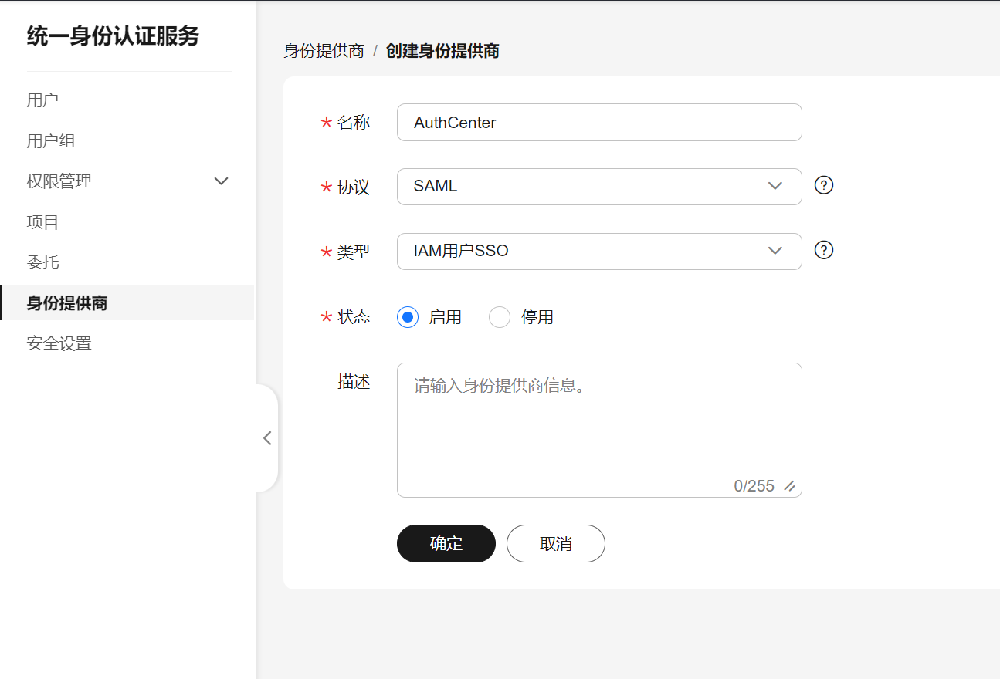
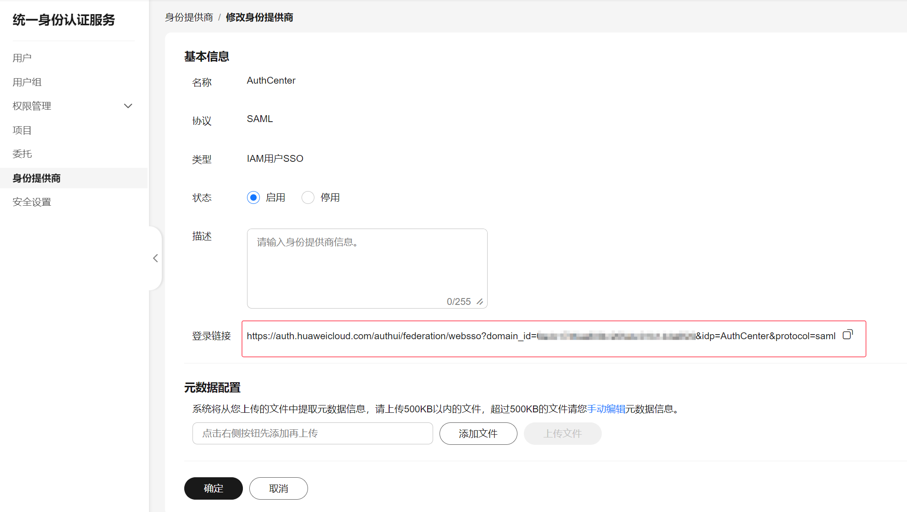
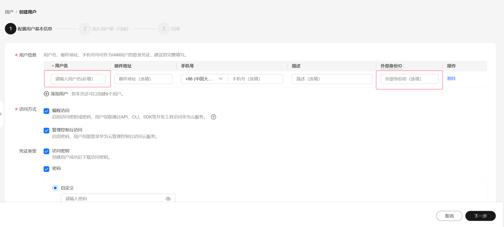
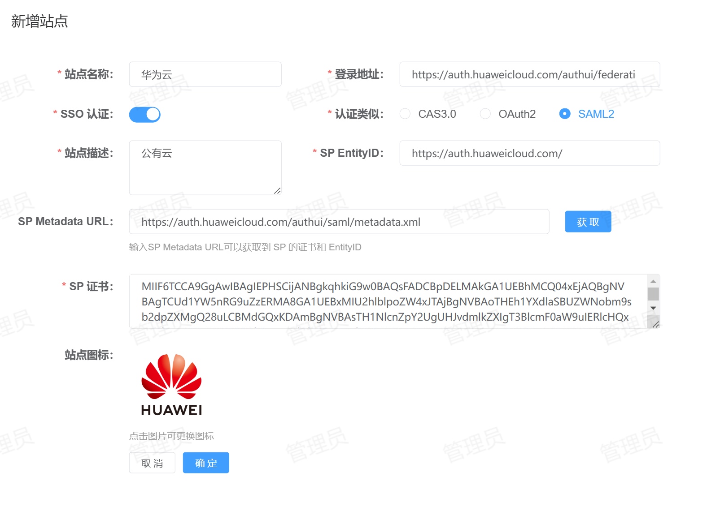

# Jenkins 单点登录
支持的单点登录方式：SAML2
## 配置方法
1. 创建身份提供商：登录华为云，进入【统一身份认证】-【身份提供商】-【创建身份提供商】如下所示：

   * 名称：指定一个名称，便于区分。
   * 协议：选择`SAML`。
   * 类型：建议使用`IAM用户SSO`，需要创建一个IAM实体用户。
   * 状态：启用。
2. 身份提供商配置：创建完身份提供商后点击【修改】进行配置，如下所示：

在这里要上传IDP（身份提供商）的元数据文件，IDP的元数据文件可以访问平台`<protocol>://<address>[:<port>]/api/v1/sso/saml/metadata`获取，将网页中的内容保存到本地`xml`格式的文件中上传即可。
   > 注意：在此页面中的登录连接将用于后续单点登录使用。
3. 创建IAM用户：进入【统一身份认证】-【用户】-【创建用户】，如下图所示：

   * 用户名：登录用户名，与平台中用户的名保持一至。
   * 外部身份ID：与用户名保持一致。
   > 说明：由于身份提供商的类型是IAM用户SSO，所以需要创建一个IAM实体用户，否则无法登录。
4. 站点注册：登录到平台，点击【资产管理】-【站点管理】-【新增】将Jenkins站点信息注册到平台，配置如下所示：
   
   * 站点名称：指定一个名称，便于用户区分。
   * 登录地址：华为云的登录地址，与华为云身份提供商配置界面保持一致。
   * SSO认证：启用。
   * 认证类型：选择`SAML2`。
   * 站点描述：描述信息。
   * SP Metadata URL：填写[华为云元数据访问地址](https://auth.huaweicloud.com/authui/saml/metadata.xml "华为云元数据访问地址")相关信息，点击【获取】可以自动从华为云元数据中加载`SP EntityID`和`SP 证书`相关信息。
5. 站点修改：登录到平台数据库，在`site`表中找到刚注册的站点信息，需要修改`domain_id`、`redirect_url`和`idp_name`这三个字段。
   * domain_id：与华为云身份提供商配置界面的登录连接中的`domain_id`保持一致。
   * redirect_url：用户登录成功后的跳转地址，如：`https://console.huaweicloud.com/console/?region=cn-east-3`。
   * idp_name：与华为云创建的身份提供商名称保持一致。