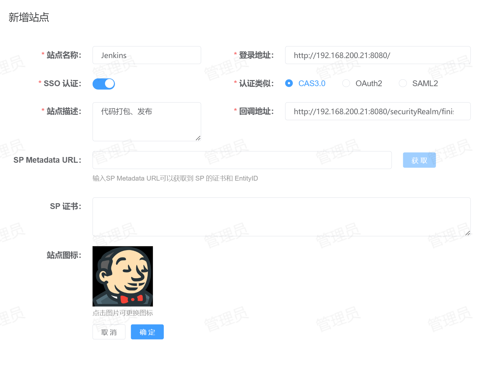
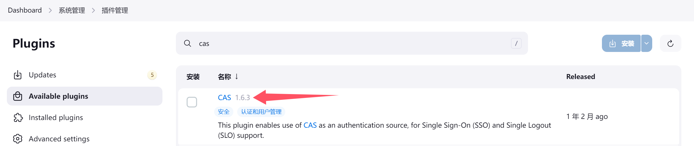
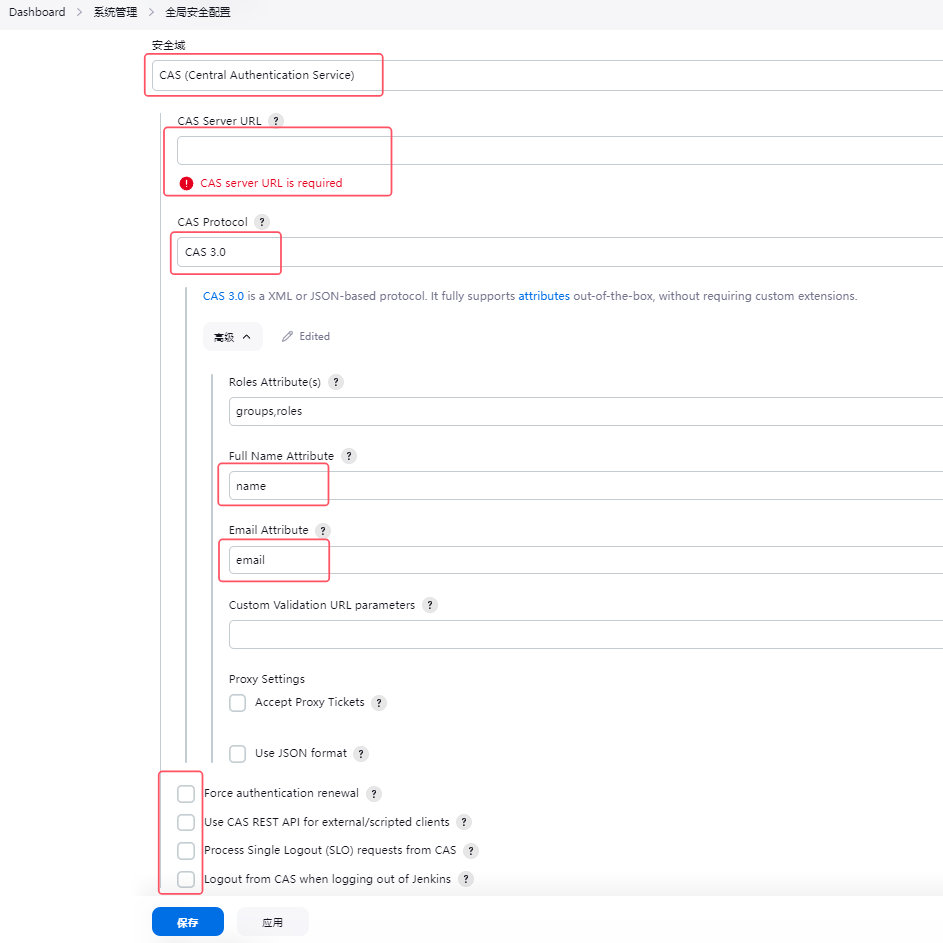

# Jenkins 单点登录
支持的单点登录方式：CAS3.0
## 配置方法
1. **站点注册**：登录到平台，点击【资产管理】-【站点管理】-【新增】将Jenkins站点信息注册到平台，配置如下所示：

   * 站点名称：指定一个名称，便于用户区分。
   * 登录地址：Jenkins的登录地址。
   * SSO认证：启用。
   * 认证类型：选择`CAS3.0`。
   * 站点描述：描述信息。
   * 回调地址：单点登录的回调地址，务必填写正确，默认为：`<protocol>://<address>[:<port>]/securityRealm/finishLogin`。
2. **插件安装**：登录到Jenkins并进入【系统管理】-【插件管理】，如下图所示：

选中箭头指示的`CAS`插件，点击右上角的【安装】，安装完成重启Jenkins即可。
3. **插件配置**：登录到Jenkins并进入【系统管理】-【全局安全配置】，如下图所示：

   请注意图中红色框，框中的配置项，必须填写正确。
   * 安全域：选择`CAS`。
   * CAS Server URL：CAS认证地址`<protocol>://<address>[:<port>]`。
   * CAS Protocol：选择`CAS 3.0`。
   * Full Name Attribute：更改为`name`。
   * Email Attribute：更改为`email`。