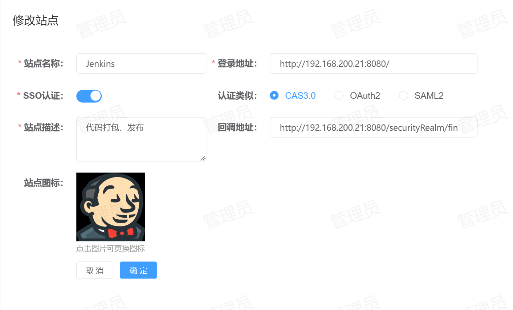
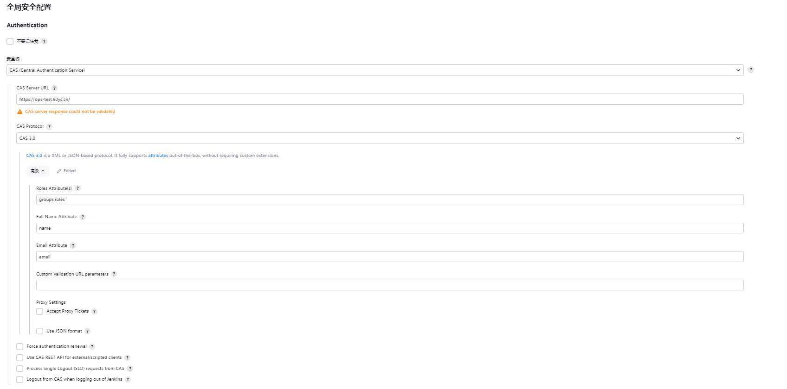

# 创建Jenkins站点
Jenkins支持使用CAS3.0进行单点登录，站点配置如下：

注：Jenkins的回调地址为：`<protocol>://<address>[:<port>]/securityRealm/finishLogin`
# 安装CAS认证插件
Jenkins要支持使用CAS3.0单点登录，需要手动安装CAS认证插件，进入到【系统管理】-【插件管理】中心进行插件安装，如下图所示：

选中箭头指示的插件，点击【安装】按钮，等待安装完成重启Jenkins即可。
# 配置CAS认证插件
配置CAS认证插件，进入到【系统管理】-【全局安全配置】中心，如下图所示：

* 安全域：选择CAS
* CAS Server URL：登录地址，不带`/login`
* CAS Protocol：CAS 3.0
* Full Name Attribute：全名，需要更改为`name`，后端返回的是这个
* Email Attribute：需要更改为`email`，后端返回的是这个
