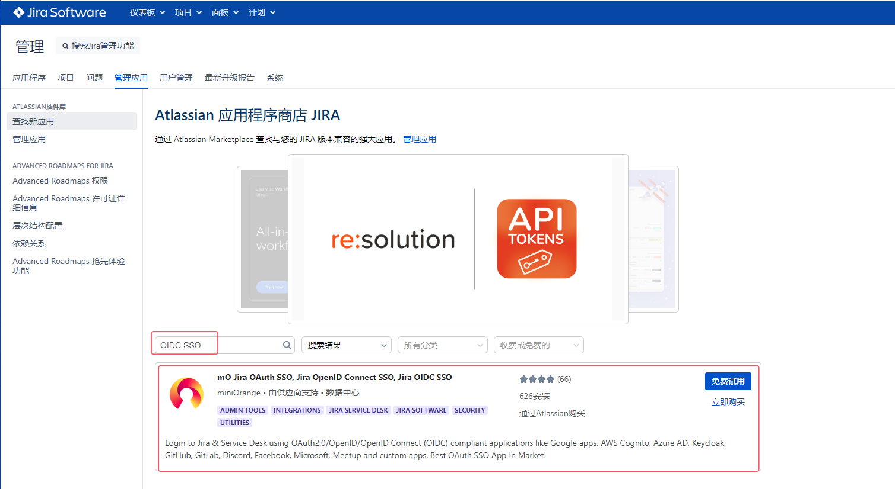
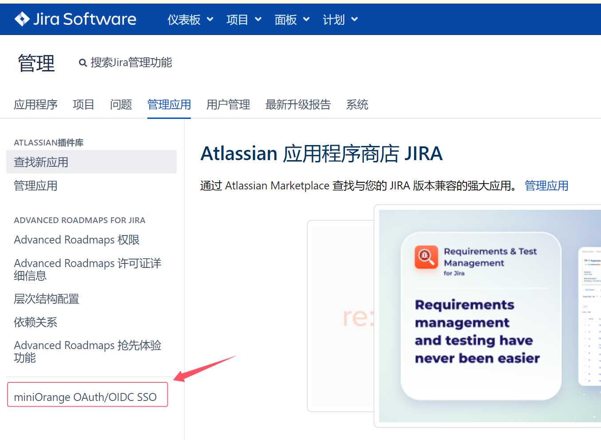
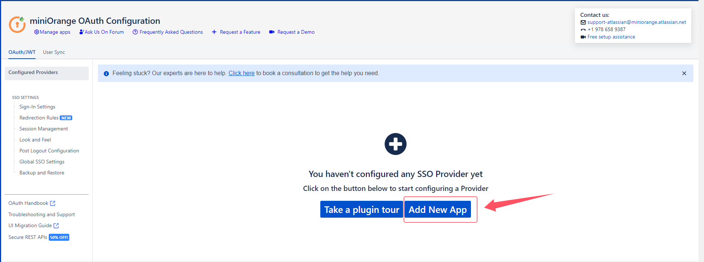
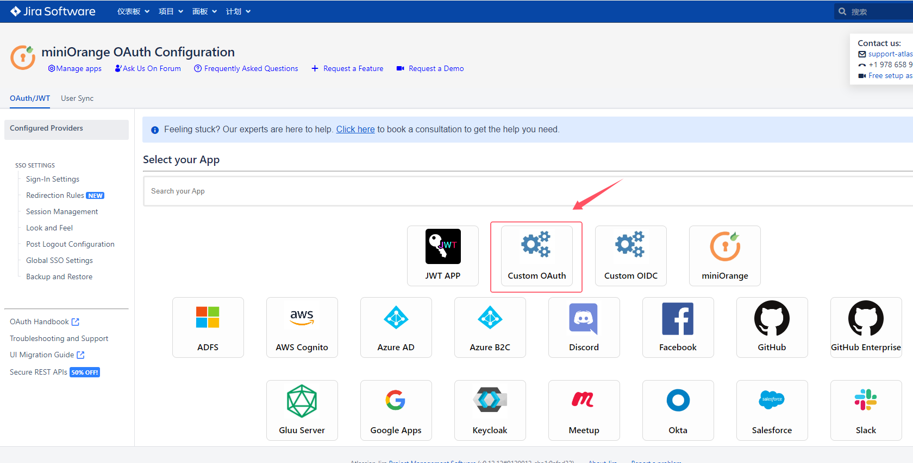
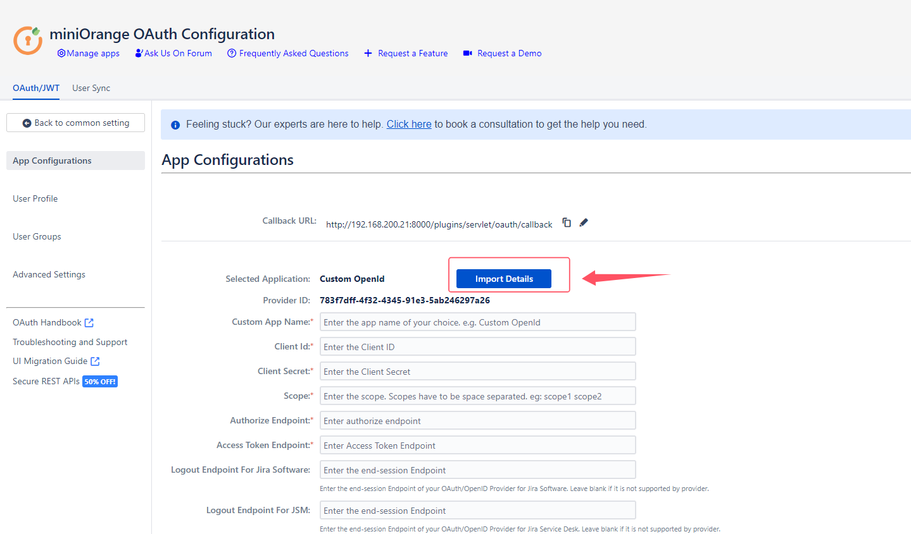
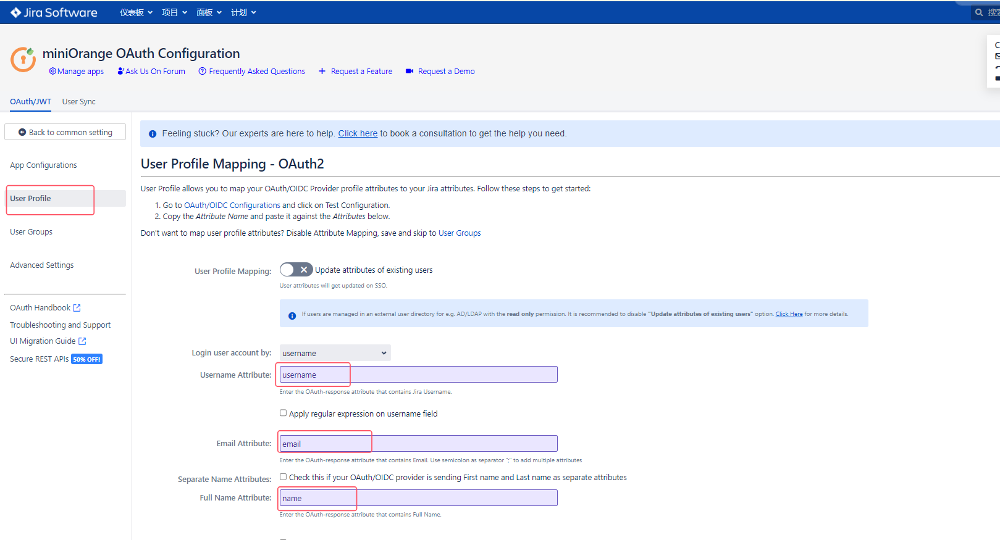
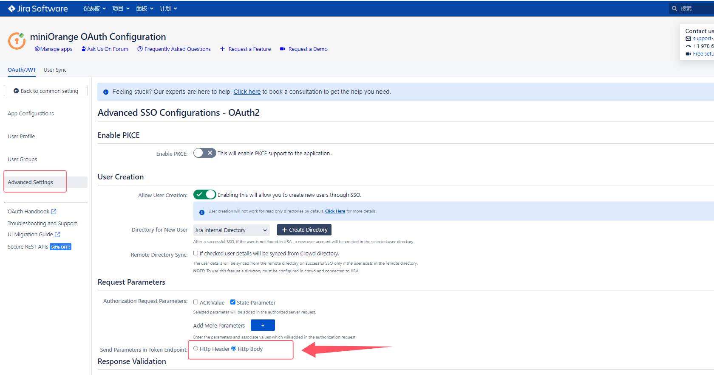

# Jira 单点登录
支持的单点登录方式：OAuth2
## 配置方法
1. **站点注册**：登录到平台，点击【资产管理】-【站点管理】-【新增】将Jira站点信息注册到平台，配置如下所示：
   
    * 站点名称：指定一个名称，便于用户区分。
    * 登录地址：Jira的登录地址。
    * SSO认证：启用。
    * 认证类型：选择`OAuth2`。
    * 站点描述：描述信息。
    * 回调地址：单点登录的回调地址，务必填写正确，默认为：`<protocol>://<address>[:<port>]/plugins/servlet/oauth/callback`。
2. **应用安装**：登录到Jira并点击右上角齿轮进入【管理应用】，在应用商店搜索`OIDC SSO`，找到如下图所示的插件并安装。

   应用安装完成后按提示申请1个30天免费适用License，并激活。
   > **提示**：该应用过期后，无法使用单点登录，可以注册一个Atlassian账号，每月申请一个30天的免费License使用。
3. **应用配置**：登录到Jira并点击右上角齿轮进入【管理应用】，点击左侧的【miniOrange OAuth/OIDC SSO】进入OIDC配置，如下图所示：

   接下来点击【Add New App】按钮创建一个身份提供商，如下图所示：

   选择【Custom OAuth】创建一个自定义OAuth应用，如下图所示：

   将OAuth的配置信息填到下面的表单中，如下图所示：

   * Custom App Name：可以自定义，用于显示在Jira的登录页
   * Client Id：在平台站点详情中获取
   * Client Secret：在平台站点详情中获取
   * Scope：`openid`
   * Authorization Endpoint：`<protocol>://<address>[:<port>]/login`
   * Access Token Endpoint：`<protocol>://<address>[:<port>]/api/v1/sso/oauth/token`
   * User Info Endpoint：`<protocol>://<address>[:<port>]/api/v1/sso/oauth/userinfo`  
   配置完成后点击【Save】保存即可。
   > **提示**：在此页面显示了Jira正确的`Callback URL`，可以将此地址复制到平台的站点配置中覆盖之前的回调地址，以确保平台配置正确。
4. **用户配置**：接上步，点击左侧的【User Profile】，需要进行用户属于配置，按如下图所示：

   * Username Attribute：`username`
   * Email Attribute：`email`
   * Full Name Attribute：`name`
   > **提示**：建议将`User Profile Mapping`选项开启，可以更新用户信息到已存在的用户。
5. **高级设置**：接上步，点击左侧的【Advanced Settings】找到`Send Parameters in Token Endpoint`，将值更改为`Http Body`，如下图所示：
