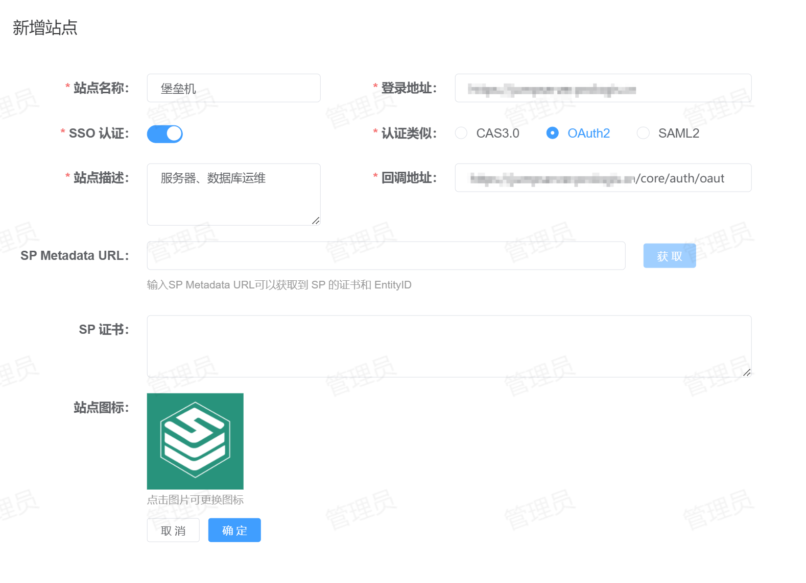
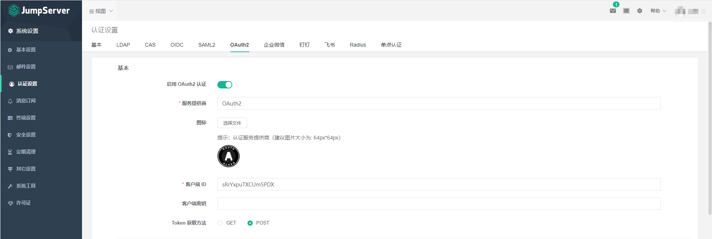

# JumpServer 单点登录
JumpServer 持的单点登录方式：OAuth2.0
## 配置方法
1. **站点注册**：登录到 IDSphere 统一认证平台，点击【资产管理】-【站点管理】-【新增】将 JumpServer 站点信息注册到 IDSphere 统一认证平台，配置如下所示：  
  
    * 站点名称：指定一个名称，便于用户区分。
    * 登录地址：JumpServer 的登录地址。
    * SSO认证：启用。
    * 认证类型：选择 `OAuth2`。
    * 站点描述：描述信息。
    * 回调地址：JumpServer 的回调地址，默认为：`http[s]://<address>[:<port>]/core/auth/oauth2/callback/`。  
2. **JumpServer配置**：登录到 JumpServer 并进入【认证设置】，如下图所示：  
  
  
   * 启用 OAuth2 认证：启用。
   * 服务提供商：便于用户区分，在 JumpServer 登录页可以看到此名称。
   * 图标：在登录的时候会展示。
   * 客户端 ID：在 IDSphere 统一认证平台站点详情中获取。
   * 客户端密钥：在 IDSphere 统一认证平台站点详情中获取。
   * Token 获取方法：选择 `POST`。
   * 范围：指定为：`openid`。
   * 授权端点地址：`<externalUrl>/login`。
   * token 端点地址：`<externalUrl>/v1/sso/oauth/token`。
   * 用户信息端点地址：`<externalUrl>/v1/sso/oauth/userinfo`。
   * 注销会话端点地址：`<externalUrl>/logout`，由于 IDSphere 统一认证平台不支持单点注销，这是一个伪地址。
   * 同步注销：不启用。
   * 总是更新用户信息：启用。
   * 用户属于映射：平台返回的字段有：`name`、`email`、`username`、`phone_number` 可根据实际需要填写。