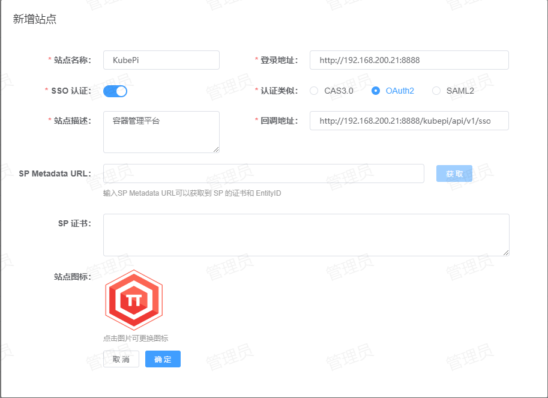

# Kubepi 单点登录
Kubepi 支持的单点登录方式：OIDC
## 配置方法
1. **站点注册**：登录到 IDSphere 统一认证平台，点击【资产管理】-【站点管理】-【新增】将 Kubepi 站点信息注册到 IDSphere 统一认证平台，配置如下所示：  
  
    * 站点名称：指定一个名称，便于用户区分。
    * 登录地址：Kubepi 控制台的登录地址。
    * SSO 认证：启用。
    * 认证类型：选择 `OAuth2`。
    * 站点描述：描述信息。
    * 回调地址：Kubepi 的回调地址，默认为：`http[s]://<address>[:<port>]/kubepi/api/v1/sso/callback`。  
2. **Kubepi OIDC 配置**：登录进 Kubepi 控制台，点击左侧【用户管理】-【SSO】如下图所示：  
  
    * 协议：选择 `OpenID Connect`。
    * 接口地址：指定 OIDC 提供商（平台）的配置地址，默认 `<externalUrl>`，Kubepi 会默认在此路径后面加上`/.well-known/openid-configuration`
    * 客户端 ID：在 IDSphere 统一认证平台站点详情中获取。
    * 客户端密钥：在 IDSphere 统一认证平台站点详情中获取。  
    填写完成后点击【Save】并重启 Kubepi。
