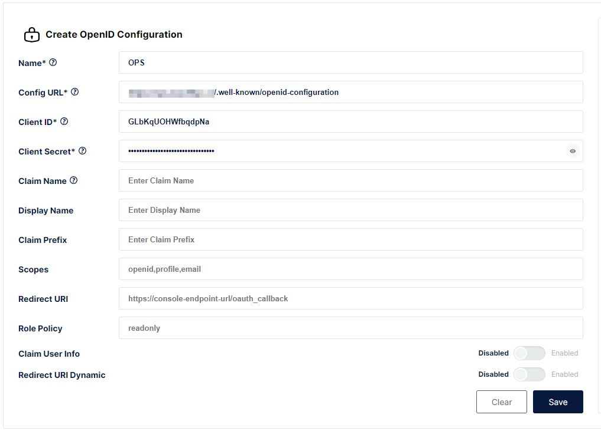

# Minio 单点登录
Minio 支持的单点登录方式：OIDC
## 配置方法
1. **站点注册**：登录到 IDSphere 统一认证平台，点击【资产管理】-【站点管理】-【新增】将 Minio 站点信息注册到 IDSphere 统一认证平台，配置如下所示：  
  
    * 站点名称：指定一个名称，便于用户区分。
    * 登录地址：Minio 控制台的登录地址。
    * SSO认证：启用。
    * 认证类型：选择 `OAuth2`。
    * 站点描述：描述信息。
    * 回调地址：Minio 的回调地址，默认为：`http[s]://<address>[:<port>]/oauth_callback`。  
2. **Minio OIDC配置**：登录进 Minio 控制台，点击左侧【Identity】-【OpenID】-【Create Configuration】创建一个 OIDC 的提供商，如下图所示：  
  
    * Name：指定一个 OIDC 提供商的名称，建议是英文，经测试中文显示会有问题。
    * Config URL：指定 OIDC 提供商（ IDSphere 统一认证平台）的配置地址，默认：`<externalUrl>/.well-known/openid-configuration`。
    * Client ID：在 IDSphere 统一认证平台站点详情中获取。
    * Client Secret：在 IDSphere 统一认证平台站点详情中获取。  
    填写完成后点击【Save】并重启 Minio 即可生效。  

   **注意**：默认使用 OIDC 单点登录到 Minio 的用户策略是 `readwrite`。