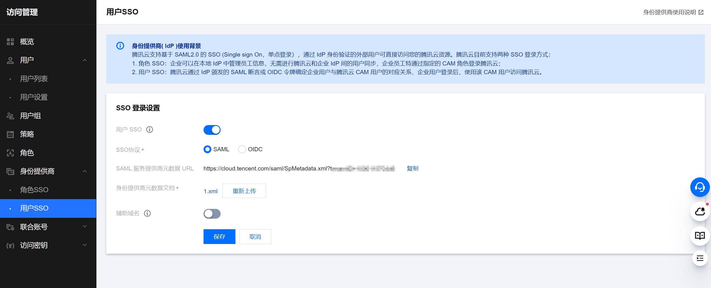
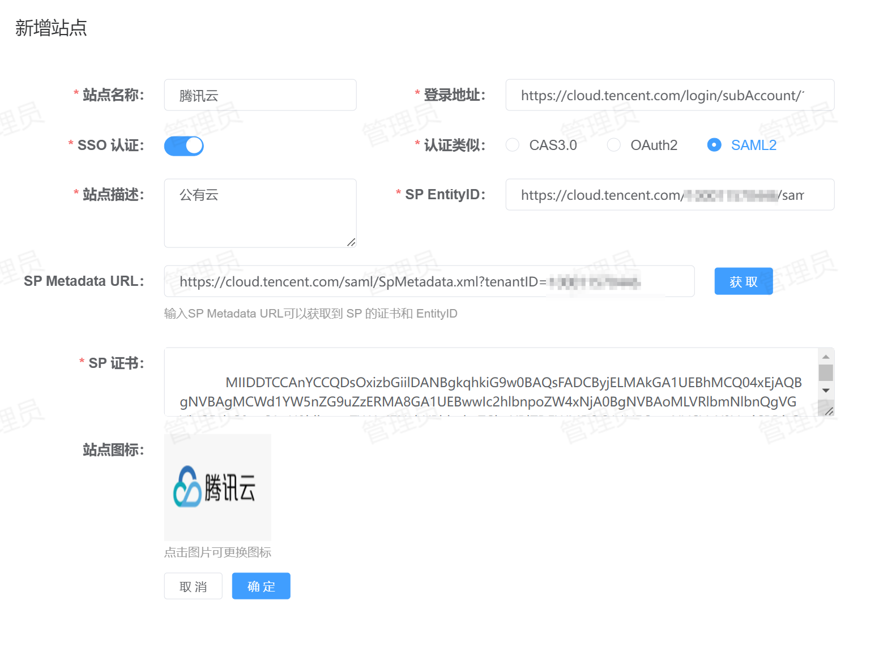

# 腾讯云单点登录
腾讯云支持的单点登录方式：SAML2
## 配置方法
1. **创建身份提供商**：登录腾讯云，进入【访问管理】-【身份提供商】-【用户SSO】，SSO 登录默认是未开启，点击右边的【编辑】开启 SSO，如下图所示：  
  
   * 用户 SSO：启用。
   * SSO 协议：`SAML`。
   * SAML 服务提供商元数据 URL：将此 URL 复制并保存，在 IDSphere 统一认证平台注册站点时需要使用。
   * 身份提供商元数据文档：IDP 的元数据文件可以访问 IDSphere 统一认证平台 `<externalUrl>/api/v1/sso/saml/metadata` 获取，将网页中的内容以`xml` 格式保存到本地并上传即可。  
2. **创建 CAM子用户**：接上步，进入【用户列表】-【新建用户】，确保用户名与平台中用户的 `username` 保持一至。当启用 SSO 后，所有子用户都无法通过账号密码方式登录腾讯云控制台，都将统一跳转至 IDP 认证。  
3. **站点注册**：登录到平台，点击【资产管理】-【站点管理】-【新增】将腾讯云站点信息注册到 IDSphere 统一认证平台，配置如下所示：  
  
   * 站点名称：指定一个名称，便于用户区分。
   * 登录地址：腾讯的登录地址，默认为：`https://cloud.tencent.com/login/subAccount/<您的账号ID>?type=subAccount`。
   * SSO 认证：启用。
   * 认证类型：选择 `SAML2`。
   * 站点描述：描述信息。
   * SP Metadata URL：填写`第1步`中 SAML 服务提供商元数据 URL，点击【获取】可以自动从腾讯云元数据中加载 `SP EntityID` 和 `SP 证书` 相关信息。