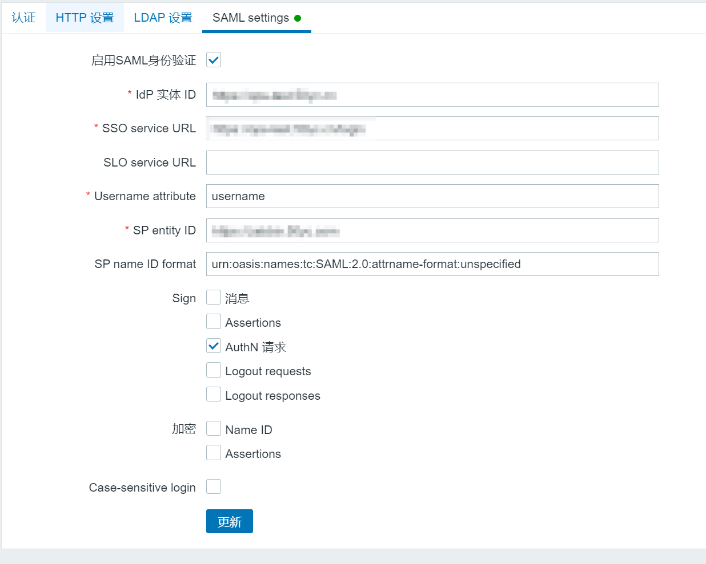

# Zabbix 单点登录
支持的单点登录方式：SAML2
## 配置方法
1. 创建密钥和证书：可以使用[在线生成工具](https://www.qvdv.net/tools/qvdv-csrpfx.html "在线生成工具")。建议证书有效期设置为10年，不设置私钥密码，生成完成后需要下载CRT证书和私钥并按以下名称命名：
   * sp.key：私钥
   * sp.crt：证书
2. 获取IDP证书：IDP的证书的存放路径为项目的`config/certs/certificate.crt`，需要将此证书下载并保存为`idp.crt`
3. 将`sp.key`、`sp.crt`、`idp.crt`上传到Zabbix站点的`ui/conf/certs/`目录下，除非`zabbix.conf.php`中提供了自定义路径，否则Zabbix默认在刚才的路径中查找文件。
4. Zabbix单点登录配置：登录到Zabbix，进入【认证】配置界面，如下图所示：

   * 启用SAML身份验证：选中复选框以启用SAML身份验证。
   * IDP实体ID：ID的唯一标识符，此处为`<protocol>://<address>[:<port>]`
   * SSO服务URL：用户登录时被重定向到的URL，此处为：`<protocol>://<address>[:<port>]/login`
   * Username attribute：固定值`username`
   * SP entity ID：通常为Zabbix的访问地址，如：`<protocol>://<address>[:<port>]`
   * SP name ID format：固定值`urn:oasis:names:tc:SAML:2.0:attrname-format:unspecified`
其它选项按图示配置即可，另外也可以参考[官方文档](https://www.zabbix.com/documentation/6.0/zh/manual/web_interface/frontend_sections/administration/authentication#advanced-settings "官方文档")进行其它配置。
5. 站点注册：登录到平台，点击【资产管理】-【站点管理】-【新增】将Zabbix站点信息注册到平台，配置如下所示：

   * 站点名称：指定一个名称，便于用户区分。
   * 登录地址：Zabbix的登录地址。
   * SSO认证：启用。
   * 认证类型：选择`SAML2`。
   * 站点描述：描述信息。
   * SP EntityID：Zabbix的SP EntityID，与Zabbix【认证】配置界面中的保持一对待。
   * SP 证书：将`sp.crt`文件内容粘贴到此处。
