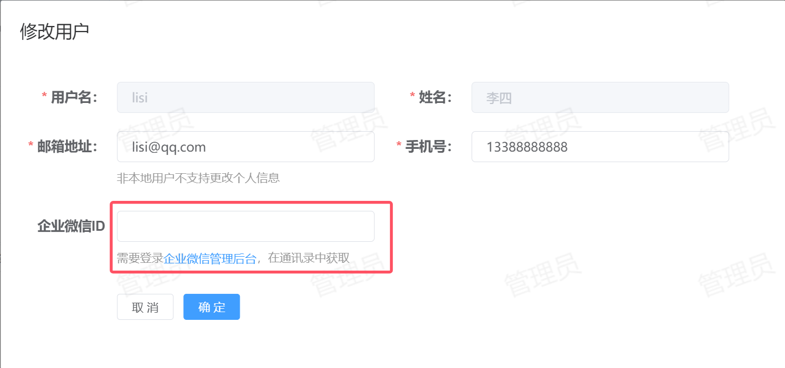

# 配置企业微信内部应用
1. **登录企业微信管理后台**：https://work.weixin.qq.com 。
2. **创建自建应用**：参考 [官方文档](https://open.work.weixin.qq.com/help2/pc/16892?person_id=1%3Freplykey%3D10aea9b3c7ab01d8948c254e43b2ww "官方文档")。
3. **配置应用登录授权**：进入【应用详情】 > 【企业微信授权登录】中配置。参考[官方文档](https://developer.work.weixin.qq.com/document/path/98151#%E5%BC%80%E5%90%AF%E7%BD%91%E9%A1%B5%E6%8E%88%E6%9D%83%E7%99%BB%E5%BD%95 "官方文档")，回调域为 IDSphere 统一认证平台访问域。
4. **设置应用可信域名**：进入【应用详情】 > 【网页授权及JS-SDK】中配置。参考[配置说明](https://open.work.weixin.qq.com/help2/pc/21316 "配置说明")和[配置介绍](https://developer.work.weixin.qq.com/document/path/98152#%E5%8F%82%E6%95%B0%E8%AF%B4%E6%98%8E "配置介绍")。
5. **设置应用可信IP**：进入【应用详情】 > 【企业可信IP】中配置。
# 后端应用配置
需要在配置中添加企业微信应用的相关配置。
```yaml
wechat:
  corpId: ""
  agentId: ""
  secret: ""
```
* [x] corpId：企业微信管理后台，【我的企业】中获取。
* [x] agentId：企业微信管理后台，应用详情中获取。
* [x] secret：企业微信管理后台，应用详情中获取。
# 前端应用配置
参考 [前端配置](https://github.com/yuyan075500/ops-web "前端配置") 相关文档，修改配置文件中关于企业微信相关的配置项，并手动构建打包项目，生成新的容器镜像。
# 创建本地用户
企业微信扫码登录需要事先在 IDSphere 统一认证平台创建对应的用户，或者从 LDAP、Windows AD 中同步用户到本地。
# 本地用户与企业微信用户关联
在本平台的用户管理页面中，点击用户右边的【编辑】进行绑定，用户对应的企业微信ID需要在企业微信管理后台中获取。
